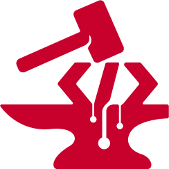

<h1 id="header">&nbsp;Reza Explains!</h1>

<h3 id="aboutMe">Hey there👋🏻, I'm Reza Azimifar!</h3>

For over 6 years, I've immersed myself in the world of programming, driven by a passion for unraveling complex challenges. My expertise lies in crafting sleek designs and writing efficient code that powers digital projects to success.

<h3 id="expertise"> 🤓 Specializing in :</h3> 

<h4>🔴 Developing responsive web applications 👨🏻‍💻   🔴 Designing user-friendly interfaces 🖌️   🔴 Solving complex coding problems 💡   🔴 Implementing effective design and SEO techniques for online growth 📈   🔴 Crafting graphic design solutions 🎨  🔴 Creating engaging online and offline games 🎮</h4> 

I'm committed to continuous learning, pioneering digital innovation, and delivering high-end solutions.

<h3 id="skill">🛠️ Tech Stack</h3>

I possess expertise in web development, covering a range of technologies such as <strong>HTML5</strong>, <strong>CSS3</strong>, and <strong>JavaScript</strong>. Additionally, I am proficient in utilizing frameworks and libraries like <strong>React.js</strong>, <strong>Redux</strong>, <strong>Three.js</strong>, <strong>jQuery</strong>, etc. My skills extend to the effective use of <strong>Bootstrap</strong>, <strong>SASS</strong>, <strong>LESS</strong>, <strong>JSON</strong>, and <strong>XML</strong>. In addition to my proficiency in web technologies, I have hands-on experience in <strong>PHP</strong>, <strong>C</strong>, <strong>C++</strong>, and <strong>C#</strong> programming. I have successfully applied my knowledge of the <strong>Unity Game Engine</strong> to design and develop multiple games. For crafting visually appealing user interfaces and effects, I leverage design tools such as <strong>Figma</strong>, <strong>Illustrator</strong>, <strong>Adobe XD</strong>, and <strong>3ds Max</strong>. To ensure efficient code management and project collaboration, I employ <strong>Git</strong> and <strong>GitHub</strong>. My diverse skill set allows me to contribute effectively to a wide array of web development and programming projects.

&nbsp;
&nbsp;
&nbsp;
&nbsp;
&nbsp;
&nbsp;
&nbsp;
&nbsp;
&nbsp;
&nbsp;
&nbsp;
&nbsp;
&nbsp;
&nbsp;
&nbsp;
&nbsp;
&nbsp;
&nbsp;
&nbsp;
&nbsp;
&nbsp;
&nbsp;
&nbsp;
&nbsp;
